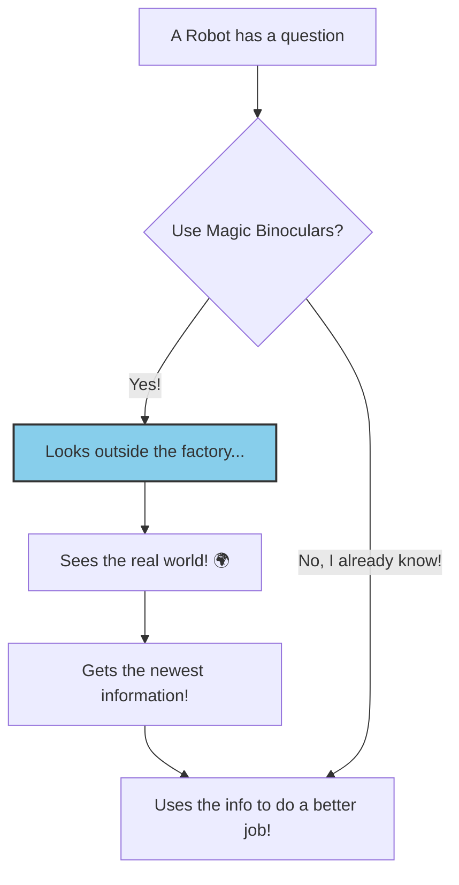

# 📰 Welcome to Our Super Story Factory! 📰

Hello again, friend! Our Magic Chat Box has gotten even more magical!

It's a factory that creates amazing news stories for you about anything you can imagine. But now, the little robots inside have a new superpower that lets them learn about things happening in the **real world, right now!**

<br>

## The Robots Have a New Superpower: Magic Binoculars! 🔭

Imagine our factory is in a little box. Before, the robots could only use what they already knew inside the box.

But now, we've given them **Magic Binoculars**!

With these binoculars, the robots can look outside the factory window and see the whole wide world (the internet!).

*   The **Story Writer Robot** can use the binoculars to see the latest, breaking news about your topic!
*   The **Sticker Maker Robot** can use them to see what fun sticker words (hashtags) are popular today!

This means your stories will be fresh and new, every single time!

Here is a map of how they use their new superpower:



<br>

## Meet the Super-Powered News Desk Team! 🖋️🐦🏷️🧐

When you ask for a news story, the **Big Boss Robot 🧠** still calls the special **News Desk Team**. But now, they have their new tools!

1.  **The Story Writer (`NewsReportAgent`)**: It uses its Magic Binoculars to research the latest news before writing the main article.
2.  **The Quick Message Writer (`TweetAgent`)**: It writes tiny, short messages for the blue bird app (Twitter).
3.  **The Sticker Maker (`SocialMediaAgent`)**: It uses its Magic Binoculars to find popular sticker words (hashtags) to help people find the story.
4.  **The Grumpy Inspector (`CriticAgent`)**: This very picky robot still checks everyone's work to make sure it's perfect.

### The Super-Duper Quality Check Game!

The team's game is now even more exciting with their new superpowers!

1.  The Big Boss tells the team the topic (like "the latest space rocket launch").
2.  The Story Writer and Sticker Maker **first use their Magic Binoculars** to look for the newest information.
3.  Then, all three writers (Story, Tweet, and Sticker) work **at the same time** to create their parts.
4.  They put all their work into a folder and give it to the **Grumpy Inspector**.
5.  The Inspector reads everything.
    -   If it's amazing, the Inspector shouts **"APPROVED! ✅"** and the story is ready!
    -   If something is wrong, the Inspector shouts **"REJECTED! ❌"** and writes notes on how to make it better.
6.  If it was rejected, the team **tries again** with the new, better instructions!

Here is a map of their new and improved game:

```mermaid
graph TD
    subgraph The News Desk's Super-Powered Game
        A[The team gets the project topic] --> B{Use Magic Binoculars? 🔭};
        B -- "Story Writer & Sticker Maker say YES!" --> C[They look outside the factory <br> for the latest info!];
        C --> D[The team creates the Story, <br> Tweets, & Stickers all at once];
        D --> E[Folder with all the work];
        E --> F{The Grumpy Inspector <br> (Is it perfect?)};
        F -- "✅ YES! APPROVED!" --> G[✨ All Done! Show the User!];
        F -- "❌ NO! REJECTED!" --> H[Inspector writes notes...];
        H --> A;
    end

    style C fill:#87CEEB,stroke:#333,stroke-width:2px
    style F fill:#FFA07A,stroke:#333,stroke-width:2px
```

<br>

## For the Grown-Ups (What the Code Does) 🤓

This project demonstrates a resilient, tool-using, multi-agent workflow using **Spring AI's Model Context Protocol (MCP)**.

*   **The Tool Shed (`mcp-server`):** We have a separate Spring Boot application that acts as a dedicated tool provider. It uses the `spring-ai-mcp-server-webflux-spring-boot-starter` and exposes tool methods (like `getLatestNews`) annotated with `@Tool`. These tools are connected to the live Google Search API.
*   **The Factory (`chat-app`):** Our main application is an MCP client.
    *   It uses the `spring-ai-mcp-client-spring-boot-starter` to automatically connect to the `mcp-server`.
    *   The `SyncMcpToolCallbackProvider` bean is automatically created, making all remote tools available for dependency injection.
*   **Tool-Enabled Agents:** The `NewsReportAgent`, `TweetAgent`, and `SocialMediaAgent` are now configured to use these remote tools. Their `ChatClient` instances are built using `defaultToolCallbacks` to register the tools provided by the `SyncMcpToolCallbackProvider`.
*   **Intelligent Tool Use:** The agents' system prompts are engineered to encourage them to use their assigned tools when necessary, allowing the LLM to decide when to call a function to get external data.

<br>

## How to Run the App 🚀

You now need **three** windows in your computer's terminal. This is very important!

1.  **Start the Tool Shed (MCP Server):**
    ```bash
    # Go to the mcp-server project folder
    cd mcp-server

    # Run the app
    ./mvnw spring-boot:run
    ```

2.  **Start the Brain (Backend):**
    ```bash
    # Go to the main chat-app project folder
    cd chat-app

    # Run the app
    ./mvnw spring-boot:run
    ```

3.  **Start the Face (Frontend):**
    ```bash
    # Go to the ui folder inside the chat-app project
    cd chat-app/ui

    # Install toys if you haven't already
    npm install

    # Start the app
    npm run dev
    ```

Now open a web browser and go to `http://localhost:5173` to play with the super-powered Magic Chat Box!

<br>

## Coolest Features ⭐

*   **Connected to the Real World!** The agents can use tools to search the internet for live, up-to-the-minute information.
*   **A Whole News Desk Team:** A dedicated team of agents for creating news reports, tweets, and hashtags.
*   **Super Fast Parallel Work:** The specialist agents all work at the same time.
*   **Critique & Retry Loop:** The agents have a boss that checks their work and makes them try again if it's not perfect.
*   **Super Resilient:** The agents talk to each other in a simple way that doesn't break easily.