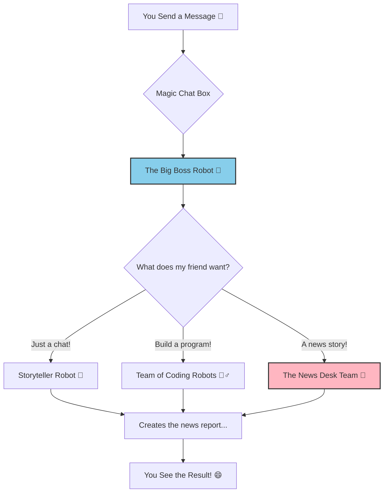

# 📰 Welcome to Our Super Story Factory! 📰

Hello there! This is a very, very magical place. It's a factory that can create stories about anything in the whole wide world!

You can ask it for a story about puppies, or space rockets, or even spooky Halloween! The factory workers will get right to it and create a special news report just for you.

It's part of our **Magic Chat Box**, which can also just have a friendly chat with you.

<br>

## How The Factory Works ✨

When you send a message, it first goes to the **Big Boss Robot 🧠**. The Big Boss is super smart and reads your message to figure out what you want.

The Big Boss asks one question: "Does my friend want to chat, build a program, or get a news story?"

Here is a map of the Big Boss's big decision:



<br>

## Meet the News Desk Team! 🖋️🐦🏷️🧐

When you ask for a news story, the Big Boss calls the special **News Desk Team**! They are the best story makers in the world.

There are four robots on this team:

1.  **The Story Writer (`NewsReportAgent`)**: This robot is a super-fast writer. It writes the main news article for you.
2.  **The Quick Message Writer (`TweetAgent`)**: This robot writes tiny, short messages, like the kind you see on the blue bird app (Twitter).
3.  **The Sticker Maker (`SocialMediaAgent`)**: This robot makes fun sticker words (hashtags!) that help other people find your story.
4.  **The Grumpy Inspector (`CriticAgent`)**: This robot is very, very picky! Its job is to read everyone's work and make sure it's perfect.

### The Super-Important Quality Check!

The team wants to make sure you get the best story ever. So, they have a special game to check their work.

1.  The Big Boss tells the team the topic (like "Halloween").
2.  The Story Writer, Quick Message Writer, and Sticker Maker all work **at the same time** in their own little rooms. This is super fast!
3.  They put all their work together into a big folder.
4.  The folder goes to the **Grumpy Inspector**.
5.  The Inspector reads everything.
    -   If it's amazing, the Inspector shouts **"APPROVED! ✅"** and the story is ready for you!
    -   If something is silly (like a boring tweet), the Inspector shouts **"REJECTED! ❌"** and writes notes on how to make it better.
6.  If it was rejected, the Big Boss reads the notes and tells the team to **try again**, but with the new, better instructions! They get one more chance to make it perfect.

Here is a map of their quality check game:

```mermaid
graph TD
    subgraph The News Desk's Game
        A[The team finishes their work] --> B[Folder with Story, Tweets, & Stickers];
        B --> C{The Grumpy Inspector <br> (Is it perfect?)};
        C -- "✅ YES! APPROVED!" --> D[✨ All Done! Show the User!];
        C -- "❌ NO! REJECTED!" --> E[Inspector writes notes...];
        E --> F[Big Boss tells the team to try again <br> with the new notes];
        F --> A;
    end

    style C fill:#FFA07A,stroke:#333,stroke-width:2px
```

<br>

## For the Grown-Ups (What the Code Does) 🤓

This project demonstrates a resilient, parallel, multi-agent workflow using **Spring AI** and **Project Reactor**.

*   **The Big Boss** is the `OrchestratorService`. It uses an LLM call with a `BeanOutputConverter` to classify user intent into `GENERAL_CHAT`, `CODE_GENERATION`, or `NEWS_REPORT`.
*   **The News Desk Team** is managed by the `NewsOrchestratorService`.
    *   It uses **`Mono.zip`** to execute the `NewsReportAgent`, `TweetAgent`, and `SocialMediaAgent` in parallel, significantly speeding up the process.
    *   It uses **`Mono.expand`** to implement the non-blocking, reactive critique-and-refine loop.
*   **Resilient Communication:** The agents in the workflow do not rely on fragile JSON for communication. The `CriticAgent` uses a simple, text-based contract (starting its response with `"APPROVED"` or `"REJECTED"`), which the orchestrator parses. This makes the internal workflow highly resilient to LLM formatting errors.
*   **User-Friendly Failure:** If the workflow fails after all attempts, it still returns the last generated (but rejected) content to the user, providing valuable context instead of just a generic error message.

<br>

## How to Run the App 🚀

You need two windows in your computer's terminal.

1.  **Start the Brain (Backend):**
    ```bash
    # Go to the project folder
    cd chat-app

    # Tell Maven to run the app
    ./mvnw spring-boot:run
    ```

2.  **Start the Face (Frontend):**
    ```bash
    # Go to the ui folder inside the project
    cd ui

    # Install all the needed toys
    npm install

    # Start the app
    npm run dev
    ```

Now open a web browser and go to `http://localhost:5173` to play with the Magic Chat Box!

<br>

## Coolest Features ⭐

*   **True Word-by-Word Streaming:** The chat feels alive because answers appear one piece at a time.
*   **A Whole News Desk Team:** The app has a dedicated team of agents for creating news reports, tweets, and hashtags.
*   **Super Fast Parallel Work:** The specialist agents all work at the same time, just like a real newsroom!
*   **Critique & Retry Loop:** The agents have a boss that checks their work and makes them try again if it's not perfect.
*   **Super Resilient:** The agents talk to each other in a simple way that doesn't break easily, making the whole factory very reliable.